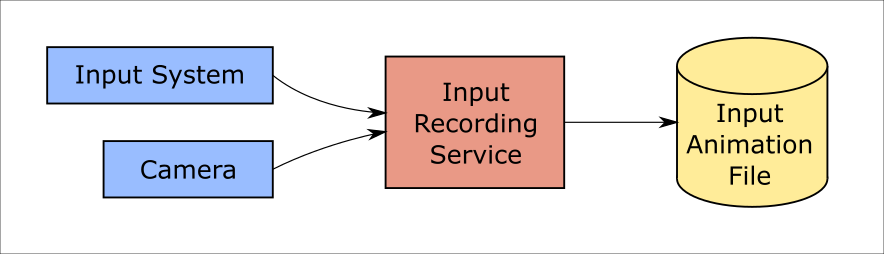
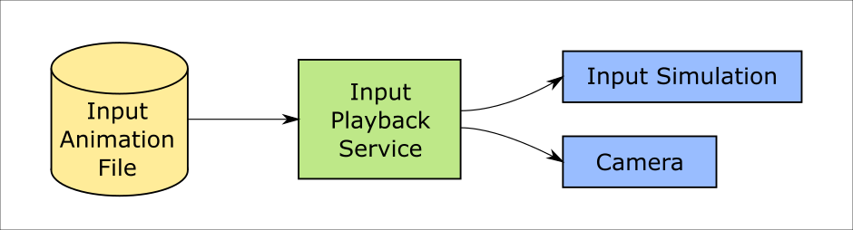
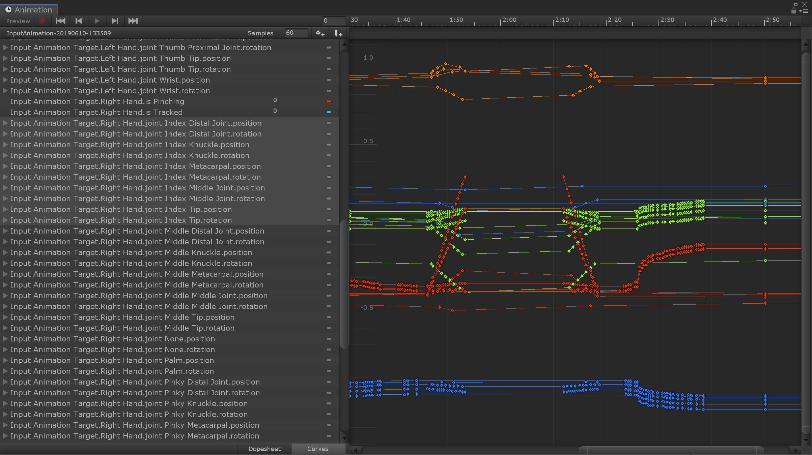

# Input Animation Recording

MRTK feature an recording system by which head movement and hand tracking data can be stored in animation files. The recorded data can then be played back using the input simulation system.

Recording input is a useful tool in a variety of situations:
* Creating automated tests for interaction, manipulations, solvers, etc.
  Creating the movement of controllers and hands for these tests can be time consuming. Recording input directly can speed up the process and provide real-world data.
  See [Writing tests using input animation](#writing-tests-using-input-animation)
* Teaching the use of UX elements through animations.
  Showing users how to interact with buttons and other objects can smooth the learning curve.
* Debugging unexpected behavior that may be encountered during regular use.
  The recording system supports a "rolling buffer" concept that allows recording recent input in the background.
  See [Input Recording Service](#input-recording-service).

# Recording and Playback services

Two input system services are provided to record and play back input respectively.

## Input Recording Service

[Input Recording Service](xref:Microsoft.MixedReality.Toolkit.Input.InputRecordingService) takes data from the main camera transform and active hand controllers and stores it in an internal buffer. When requested this data is then serialized into binary files for storage and later replay.

To start recording input call the [StartRecording](xref:Microsoft.MixedReality.Toolkit.Input.IMixedRealityInputRecordingService.StartRecording) function. [StopRecording](xref:Microsoft.MixedReality.Toolkit.Input.IMixedRealityInputRecordingService.StopRecording) will pause recording (but not discard the data recorded so far, use [DiscardRecordedInput](xref:Microsoft.MixedReality.Toolkit.Input.IMixedRealityInputRecordingService.DiscardRecordedInput) to do this if needed).

By default the size of the recording buffer is limited to 30 seconds. This allows the recording service to keep recording in the background without accumulating too much data, and then save the last 30 seconds when required. The time interval can be changed using the [RecordingBufferTimeLimit](xref:Microsoft.MixedReality.Toolkit.Input.IMixedRealityInputRecordingService.RecordingBufferTimeLimit) property, or recording can be unlimited using the [UseBufferTimeLimit](xref:Microsoft.MixedReality.Toolkit.Input.IMixedRealityInputRecordingService.UseBufferTimeLimit) option.

The data in the recording buffer can be saved in a binary file using the [SaveInputAnimation](xref:Microsoft.MixedReality.Toolkit.Input.IMixedRealityInputRecordingService.SaveInputAnimation*) function.

For details on the binary file format see [Input Animation File Format Specification](InputAnimationFileFormat.md).

## Input Playback Service

[Input Playback Service](xref:Microsoft.MixedReality.Toolkit.Input.InputPlaybackService) reads a binary file with input animation data and then applies this data through the [Input Simulation Service](xref:Microsoft.MixedReality.Toolkit.Input.InputSimulationService) to recreate the recorded movements.

To start playing back input animation it should be loaded from a file using the [LoadInputAnimation](xref:Microsoft.MixedReality.Toolkit.Input.IMixedRealityInputPlaybackService.LoadInputAnimation*) function.

Call [Play](xref:Microsoft.MixedReality.Toolkit.Input.IMixedRealityInputPlaybackService.Play), [Pause](xref:Microsoft.MixedReality.Toolkit.Input.IMixedRealityInputPlaybackService.Play), or [Stop](xref:Microsoft.MixedReality.Toolkit.Input.IMixedRealityInputPlaybackService.Stop) to control the animation playback.

The current animation time can also be controlled directly with the [LocalTime](xref:Microsoft.MixedReality.Toolkit.Input.IMixedRealityInputPlaybackService.LocalTime) property.

> [!WARNING]
> Looping or resetting input animation or setting [LocalTime](xref:Microsoft.MixedReality.Toolkit.Input.IMixedRealityInputPlaybackService.LocalTime) directly by scrubbing the timeline may yield unexpected results when manipulating the scene! Only the input movements are recorded, any additional changes such as moving objects or flipping switches will not be reset. Make sure to reload the scene if irreversible changes have been made.

# Editor tools for recording and playing input animation

>TODO: added in separate PR

# Conversion to and from AnimationClip

When recording and saving input data it is stored in a binary format that is optimized for size. However, it can be desirable to edit input animations after recording, e.g. to prune and move keyframes. For this purpose input animations can be converted into [Unity AnimationClip](https://docs.unity3d.com/ScriptReference/AnimationClip.html) assets. To import a binary input animation file as AnimationClip:
* Right-click on the binary file in the asset browser and select _Mixed Reality Toolkit > Import Input Animation_
* OR Select _Mixed Reality Toolkit > Utilities > Import Input Animation_ from the main menu and select a binary file from the dialog.

The resulting AnimationClip can be edited in the [Unity animation editor](https://docs.unity3d.com/Manual/animeditor-UsingAnimationEditor.html).

It is recommended to export animations back to binary format after editing. To do this:
* Right-click on an AnimationClip asset in the asset browser and select _Mixed Reality Toolkit > Export Input Animation_
* OR Select an AnimationClip asset in the asset browser, then select _Mixed Reality Toolkit > Utilities > Export Input Animation_ from the main menu

> [!WARNING]
> The use of AnimationClips as permanent storage for input animation is not recommended:
> * Regular Unity serialization uses YAML files, which are inefficient for large amounts of data and take a lot of space.
> * AnimationClip are not designed for the amount of animation curves stored by the input recording (300+).
> * Applying animation from AnimationClip requires a [GameObject-based dummy target](xref:Microsoft.MixedReality.Toolkit.Input.InputAnimationTarget) and supporting scene additions (AnimationController asset and Animator component).

# Writing tests using input animation

>TODO
